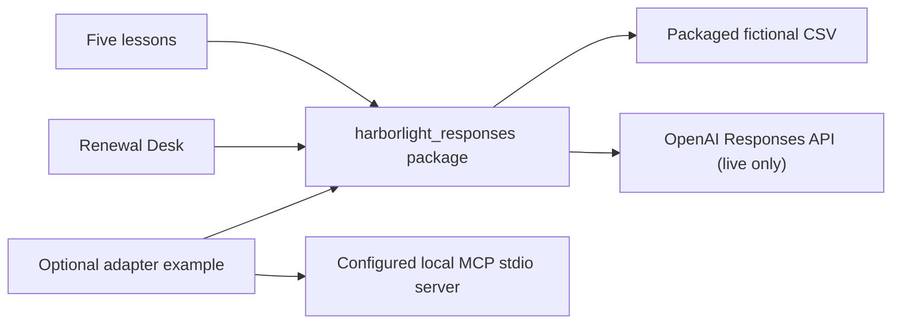

# Harborlight Responses 101 implementation plan

Date: 2026-07-14  
Feature branch: `feat/harborlight-responses-101`  
Base: Responses repository `origin/main` at `c80cdf14ec959fa261bac216060b7151da7407b6`

## Repository condition and preflight

The Responses working clone was on local `main` at `12cdcab413f9fb96e2a3d7123e6ab47794283e34`, two commits behind `origin/main` (`0 2` from `git rev-list --left-right --count HEAD...origin/main`). Its only visible uncommitted item was the untracked `docs/FABLE_RECOMMENDATIONS.md`. The report was copied byte-for-byte into this clean worktree; both copies had SHA-256 `5D8AFE4153ECD09306CFA5899BC1A8AE2C48D9BE23A7C5AD8DBC5736F47B0A33`.

The MCP reference clone was on local `main` at `61081431728bc6e1bf971204035b5a1682db45c8`, 55 commits behind `origin/main` (`0 55`), with modified `.gitignore`, `README.md`, and `requirements.txt`. That clone remains untouched. Reference content was read with `git show origin/main:<path>`.

The Harborlight CSV is mirrored from:

- repository: `https://github.com/itprodirect/Model-Context-Protocol-101`
- path: `src/harborlight_mcp/data/fictional_policies.csv`
- commit: `c872f1d46182bf191947a2477d4b0487f970c7f2`
- mirror date: `2026-07-14`

The copy is intentionally independent at runtime. This project neither imports nor locates the MCP repository.

## Preservation, archive, removal, and rewrite map

Preserved:

- `docs/FABLE_RECOMMENDATIONS.md`, exactly as supplied locally.
- `LICENSE` and the repository's Git history.
- prior review documents, moved to `docs/history/`.
- useful legacy notebooks, moved unchanged to `archive/legacy_notebooks/`.

Removed from the maintained learning path:

- the third-party root transcript.
- the scratch connection notebook containing “Tell Nick how awesome he is”.
- stale committed notebook outputs, old model examples, path hacks, and incomplete tool-loop teaching.

Rewritten:

- `README.md`, packaging, configuration, API helpers, tests, notebooks, and CI.
- the active curriculum as exactly five Harborlight lessons.
- the active application as a focused Renewal Desk, not a general chatbot.

## Fable recommendations

Accepted:

- Harborlight as the single fictional teaching universe.
- a `src/` package, `pyproject.toml`, pytest, Ruff, CI, and clean-state notebook execution.
- deletion of the hand-maintained model catalog.
- deterministic services independent of API access and independent of MCP 101.
- strict fictional-data validation and integer-cent/Decimal arithmetic.
- complete function-tool round trips with visible tool activity.
- no claims of hidden reasoning; concise rationale and observable evidence instead.
- archiving useful history and deleting third-party/scratch noise.
- a restrained, explicitly labeled fixture mode.

Modified by the mission:

- Fable proposed four core lessons plus an MCP notebook capstone and postponed web search. Version one instead has the user-specified five core lessons, with hosted web search as lesson 5 and MCP as a separate optional example.
- Fable recommended no committed notebook outputs. CI still starts from stripped notebooks, while execution artifacts are temporary; explanatory fixture values are stored as clearly labeled package data/markdown, never as live output.
- Fable suggested a very narrow recorded app transcript. Demo mode remains narrow but executes real deterministic services and uses typed checked-in fixtures for model-facing portions.
- The raw HTTP material is omitted from the core lesson and may be added only as a compact future appendix if it teaches a distinct concept.

Intentionally postponed:

- file search and vector stores.
- native remote Responses MCP and remote HTTP deployment.
- authentication, accounts, databases, telemetry, production hosting, and generalized chat.
- advanced programmatic tool calling, multi-agent orchestration, and a broad model catalog.
- screenshots until the working app can be captured without identifiers, secrets, or local paths.

## Exact version-one scope

1. First response: SDK setup, `instructions`, `input`, `output_text`, metadata, usage, and fixture/live boundaries.
2. Typed renewal review: Pydantic, `responses.parse`, `output_parsed`, refusal/missing-result handling, and verified premium arithmetic.
3. Function tools: strict schemas, argument validation, local execution, `function_call_output`, continuation, multiple calls, and bounded rounds.
4. State: short `previous_response_id` chaining and durable Conversations API examples, storage/cost guidance, and fixture distinctions.
5. Hosted web search: dated live evidence, citations/sources, generated interpretation, weak-source handling, and a dated demo fixture.
6. A two-workflow Gradio Renewal Desk with visible request/model/tool/result/fixture/evidence/usage/latency boundaries.
7. An optional local stdio MCP adapter example, clearly distinguished from native remote MCP.

## Architecture

The core package owns validated fictional data, deterministic services, Pydantic contracts, model configuration, response helpers, a bounded tool loop, fixtures, and a small transparency event type. Notebooks and the app consume that package. OpenAI and Gradio clients are created only inside explicit live operations. The optional MCP extra owns the stdio adapter.

## Checkpoints and commits

1. `docs: define Harborlight Responses rebuild` — plan, preserved report, cleanup/archive, directory skeleton, and data provenance.
2. `feat: add Harborlight deterministic core` — package metadata, configuration, schemas, data, services, fixtures, and unit tests.
3. `feat: build Harborlight Responses curriculum` — current SDK helpers, parsing, tool loop, five notebooks, and notebook tests.
4. `feat: add Harborlight Renewal Desk` — focused Gradio app, fixture/live separation, transparency panels, and app tests.
5. `feat: add optional Responses-to-MCP adapter` — safe stdio adapter, advanced example, mocks, and documentation.
6. `docs: prepare Harborlight Responses flagship release` — README, CI, hygiene checks, handoff, and final validation.

## Test strategy

- Unit tests cover dataset validation, inclusive renewal windows, premium changes and rounding, environment-only configuration, structured parsing, strict tool schemas, argument validation, tool failures, multiple calls, continuation, and maximum rounds.
- App tests call workflow functions directly and verify that fixture mode uses deterministic services while live mode rejects a missing key.
- MCP tests mock the SDK boundary and command construction; no sibling repository or server is required.
- Repository-hygiene tests scan maintained files for secrets, machine paths, reusable response/conversation IDs, stale models, and executed live notebook output.
- CI installs extras from `pyproject.toml`, runs Ruff and pytest, executes all notebooks without a key, and imports the application without launching it on Python 3.10 and 3.13.

## Measurable acceptance criteria

- A clean install succeeds with `python -m pip install -e ".[dev,notebooks,app,mcp]"`.
- Ruff and pytest return exit code 0.
- All five notebooks execute from a clean state with `OPENAI_API_KEY` absent.
- `python -c "import app.harborlight_renewal_desk"` exits without starting a server.
- Fixture workflows include the exact fixture label and run deterministic services.
- The dataset has six valid fictional rows and `days=30` returns FIC-HLA-1001 through FIC-HLA-1003.
- Tool continuation includes matching `function_call_output.call_id` values and stops within the configured maximum rounds.
- No maintained file contains a key, machine-specific user path, reusable live response/conversation identifier, obsolete model catalog, or stale live-search claim.
- The optional adapter uses an argument list, never `shell=True`, and fails with recovery guidance when unavailable.
- The final branch contains exactly six logical implementation commits after the base, is pushed, and has an unmerged draft PR.
